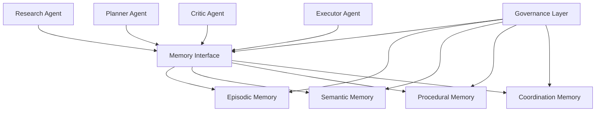

# Multi-Agent Memory Systems

A modular reference architecture for designing memory systems in multi-agent AI applications.

This repository explores how memory becomes the coordination substrate for groups of agents. Instead of treating memory as a simple vector database or chat history, this project treats memory as a structured system that helps agents remember, coordinate, recover from failure, and improve over time.

## Core Thesis

Single agents need memory to behave consistently.

Multi-agent systems need memory to coordinate.

When many agents work together, the hard problem is not only task execution. The hard problem is shared context, conflict resolution, continuity, responsibility, learning, and trust. Memory becomes the layer that connects these pieces.

## What This Repo Is

This repo is a structured thinking and implementation space for:

- Multi-agent memory architecture
- Shared and private memory design
- Agent coordination loops
- Memory schemas
- Failure modes in collective agent systems
- Simple working demos for memory-enabled collaboration
- Practical use cases in robotics, research, business development, design, and operations

## What This Repo Is Not

This is not a production agent framework.

This is not another wrapper around LLM calls.

This is not only a vector database demo.

The goal is to build conceptual clarity and practical prototypes for how memory should work when multiple agents collaborate over time.

## Why Multi-Agent Memory Matters

Most agent systems fail because they forget context, repeat mistakes, overwrite each other, or do not know what other agents have already decided.

A useful memory system helps agents answer questions like:

- What has already been tried?
- What did we learn from the last attempt?
- Which agent owns which responsibility?
- Which decisions are still valid?
- Which memories should be trusted?
- Which memories are stale?
- What should be shared with other agents?
- What should remain private to one agent?

Without this layer, multi-agent systems become noisy Slack channels with API keys.

## Architecture Overview

The proposed system has four main layers:

1. **Agents**  
   Specialized workers such as researcher, planner, critic, executor, reviewer, or domain expert.

2. **Memory Interface**  
   A controlled read/write layer that decides what agents can access, write, update, or forget.

3. **Memory Substrate**  
   The storage layer for episodic, semantic, procedural, and coordination memory.

4. **Governance Layer**  
   Rules for conflict resolution, memory validation, salience scoring, decay, permissions, and auditability.



## Memory Types

| Memory Type | Purpose | Example |
|---|---|---|
| Episodic Memory | Stores events and attempts | Agent tried strategy A and failed |
| Semantic Memory | Stores stable knowledge | Customer prefers concise updates |
| Procedural Memory | Stores reusable methods | Use checklist before deployment |
| Coordination Memory | Stores team state | Planner is waiting for critic review |
| Failure Memory | Stores mistakes and recovery paths | Previous run failed due to missing input |
| Preference Memory | Stores user or team preferences | User wants direct answers |

## Example Use Cases

### Research Agent System
Multiple agents collect, summarize, critique, and synthesize research. Shared memory prevents duplication and tracks which sources are trusted.

### Business Development Agent System
One agent scrapes prospects, another qualifies them, another writes outreach, and another tracks replies. Memory stores decision criteria and follow-up context.

### Robotics Agent System
A planner, perception agent, execution agent, and recovery agent coordinate around task state. Memory stores failed grasps, environment changes, and successful recovery policies.

### Design Studio Agent System
Research, moodboard, copy, strategy, and critique agents share evolving project memory so design decisions remain coherent across iterations.

## Planned Repository Structure

```text
.
├── README.md
├── docs/
│   ├── 01_problem.md
│   ├── 02_architecture.md
│   ├── 03_memory_types.md
│   ├── 04_agent_coordination.md
│   ├── 05_failure_modes.md
│   ├── 06_use_cases.md
│   └── 07_future_work.md
├── examples/
│   └── simple_multi_agent_memory_demo/
│       ├── README.md
│       ├── agents.py
│       ├── memory_store.py
│       ├── run_demo.py
│       └── sample_memory.json
└── LICENSE
```

## Current Status

| Area | Status |
|---|---|
| Core thesis | Drafted |
| Architecture | In progress |
| Documentation | In progress |
| Working demo | Planned |
| Use cases | Drafted |
| Production readiness | Not production-ready |

## Roadmap

### Phase 1: Foundation

- Add README
- Add architecture document
- Add problem statement
- Add memory type breakdown
- Add agent coordination model

### Phase 2: Prototype

- Build a simple Python demo
- Add shared memory store
- Add research, planner, and critic agents
- Show memory being written and reused across runs

### Phase 3: Advanced Concepts

- Add memory trust scoring
- Add stale memory detection
- Add memory conflict resolution
- Add permissions for private vs shared memory
- Add audit trail for agent decisions

### Phase 4: Applied Systems

- Add robotics scenario
- Add business development scenario
- Add research workflow scenario
- Add design studio scenario

## Suggested Demo Flow

```text
Research Agent finds information
Planner Agent converts it into a plan
Critic Agent reviews the plan
Shared Memory stores facts, decisions, objections, and failures
Next run uses memory to improve behavior
```

## Positioning

This repo is part of a broader investigation into memory as a first-class design layer for AI systems.

The long-term goal is to develop practical frameworks for building agents that do not just respond, but remember, coordinate, and improve.
